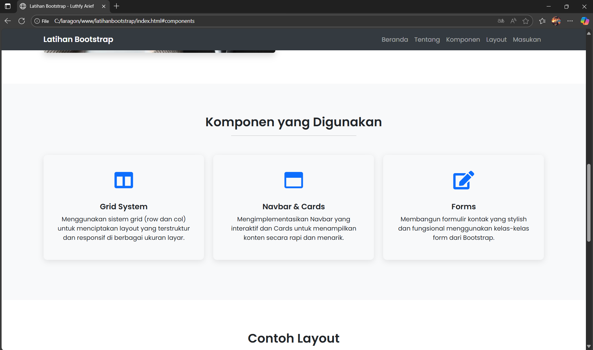

# Latihan Landing Page Bootstrap

Proyek ini merupakan sebuah website landing page modern yang dibuat sebagai latihan menggunakan HTML dan Bootstrap 5. Website ini mendemonstrasikan implementasi berbagai komponen dan layout untuk membuat halaman yang fungsional dan menarik secara visual.

---

## Fitur Utama

-   **Navigasi Interaktif (Navbar)** dengan efek glassmorphism (blur) yang akan berubah menjadi solid saat halaman di-scroll.
-   **Hero Section** layar penuh dengan gambar latar belakang dan overlay untuk keterbacaan teks yang lebih baik.
-   **Section Komponen** yang menampilkan fitur-fitur Bootstrap yang digunakan, seperti Grid System, Cards, dan Forms, disajikan dalam kartu yang stylish.
-   **Section Layout** sebagai contoh galeri portofolio sederhana dengan efek hover pada gambar.
-   **Formulir Masukan** yang bersih dan fungsional untuk interaksi pengguna.
-   **Desain Responsif** — memastikan tampilan tetap optimal di berbagai perangkat, mulai dari desktop hingga mobile.
-   **Footer** sederhana dengan informasi hak cipta.

---

## Teknologi yang Digunakan

-   **HTML5**
-   **CSS3** (Custom styling & animations)
-   **Bootstrap 5.3.2**
-   **JavaScript** (Vanilla JS untuk fungsionalitas scroll navbar)
-   **Font Awesome** (Untuk ikon)
-   **Google Fonts** (Poppins)

---

## Cara Menjalankan

Karena ini adalah proyek web statis, Anda tidak memerlukan server lokal. Cukup klik dua kali file `index.html` yang Anda miliki, dan halaman akan langsung terbuka di browser default Anda.

Jika Anda ingin menjalankannya melalui server lokal:

1.  Pastikan Anda sudah menginstal **XAMPP**, **Laragon**, atau sejenisnya.
2.  Simpan folder proyek Anda di dalam direktori `htdocs` (XAMPP) atau `www` (Laragon).
3.  Jalankan server lokal Anda.
4.  Buka `http://localhost/NAMA_FOLDER_PROYEK_ANDA/` di browser.

---

## 🖥️ Tampilan Website

Tampilan Hero Section dengan Navbar Blur

  

Tampilan Section Komponen

  

Tampilan Formulir Masukan

  

---

## Pembuat

**Nama:** Luthfy Arief   
**NIM:** 23552011045   
**Kelas:** TIF RP-23 CNS A   
**Kampus:** Universitas Teknologi Bandung

---

## Lisensi

Proyek ini dibuat untuk keperluan pembelajaran mata kuliah Pemrograman Web. Silakan digunakan dan dikembangkan lebih lanjut untuk tujuan akademik dan pembelajaran.
